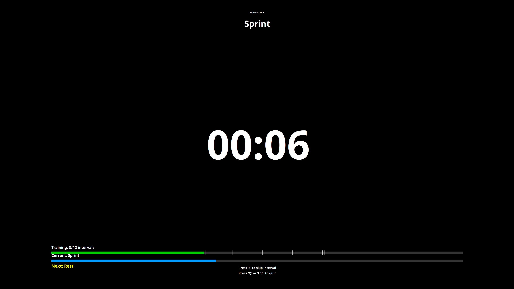

# Interval Training Timer

A high-contrast, full-screen interval training timer written in C for Linux systems.



### System Dependencies

**For Manjaro/Arch Linux:**
```bash
sudo pacman -S gcc make libx11 libxext alsa-lib cairo libxrandr
```

### Compilation

```bash
make
```

## Usage

```bash
./interval_timer strength_intervals.txt
```